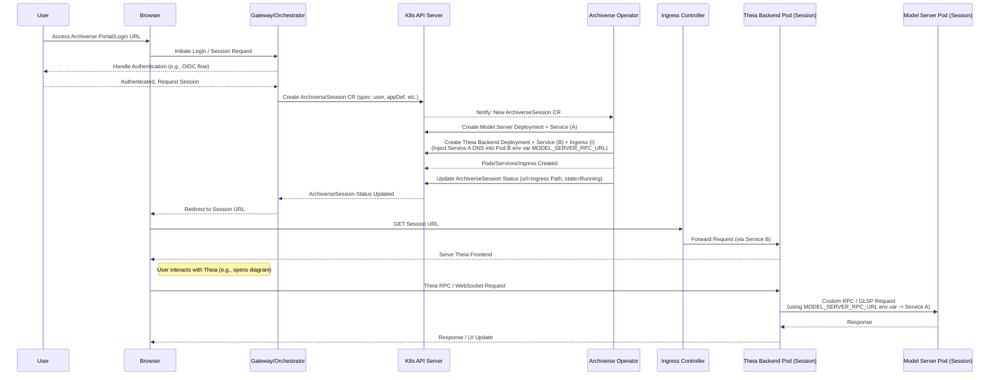

# Deployment Architecture (Kubernetes & Operator Pattern)

This document details the primary target architecture for deploying the Archiverse ecosystem in a cloud-native environment like Kubernetes, focusing on multi-tenancy, scalability, and dynamic resource management. The deployment strategy leverages the **Kubernetes Operator pattern**, inspired by and utilizing components from the **Theia Cloud** project (see `submodules/theia-cloud-helm` and `submodules/archiverse-infra`).

All Kubernetes manifests, Helm charts, Operator logic, and Custom Resource Definitions (CRDs) are managed within the `archiverse-infra` repository.

## Core Principle: Dynamic Per-User Sessions via Operator

To provide isolation and manage resources effectively in a multi-tenant environment, Archiverse employs a Kubernetes Operator (`archiverse-operator`, based on Theia Cloud) that dynamically provisions and manages dedicated resources for each active user session.

*   **Goal:** Isolate user workspaces, ensure predictable performance (by dedicating resources), and optimize resource consumption by creating resources on demand and destroying them upon session termination.
*   **Mechanism:** Utilizes Custom Resource Definitions (CRDs) like `ArchiverseSession` (derived from `theia.cloud/Session`), `ArchiverseWorkspace`, and `ArchiverseAppDefinition` (likely defined in `archiverse-infra/crds/`). The `archiverse-operator` watches these resources and reconciles the desired state by manipulating native Kubernetes objects (Pods, Services, Ingresses, etc.).

## Components in the Operator-Based Deployment Model

1.  **`archiverse-operator` (Deployment):**
    *   The custom controller running in the cluster.
    *   Watches `ArchiverseSession` resources.
    *   Contains the logic to create, configure, monitor, and delete all resources associated with a user session.

2.  **Session Orchestrator / Gateway (Deployment + Service):**
    *   The entry point for users.
    *   Handles user authentication (e.g., via Keycloak/OIDC integration defined in `archiverse-infra`).
    *   Interacts with the Kubernetes API Server to create/delete `ArchiverseSession` CRs upon user login/logout or session request/termination.
    *   May initially proxy user traffic or redirect users to their unique session URL once the Operator reports it as ready.

3.  **Custom Resource Definitions (CRDs):**
    *   `ArchiverseSession`: Defines the specification for a user's session (user ID, desired app definition, workspace reference, custom environment variables). Its `status` reflects the session's state and access URL.
    *   `ArchiverseWorkspace`: Defines persistent storage aspects for a session (if applicable).
    *   `ArchiverseAppDefinition`: Defines reusable templates for Theia applications (e.g., Docker image for `archiverse-theia`, base configuration, resource requests/limits).

4.  **Dynamically Created Per-Session Resources (Managed by Operator):** For each `ArchiverseSession` CR, the Operator typically creates:
    *   **`archiverse-model-server` Pod(s) & Service:** A dedicated instance of the core logic server, running in its own Pod(s) managed by a Deployment or StatefulSet. Exposed internally via a unique Kubernetes Service (e.g., `session-<id>-model-svc`).
    *   **`archiverse-theia` Backend Pod(s) & Service:** A dedicated instance of the Theia backend host (from `hosts/browser-app` image), running its own Pod(s). Exposed internally via a unique Kubernetes Service (e.g., `session-<id>-theia-svc`). **Crucially, the Operator injects the unique internal DNS address of the session's `archiverse-model-server` Service into this Pod via an environment variable (e.g., `MODEL_SERVER_RPC_URL=ws://session-<id>-model-svc.namespace.svc.cluster.local:PORT`)**.
    *   **Ingress Resource:** Configures the cluster's Ingress Controller (e.g., Kong, managed via `archiverse-infra`) to route external traffic for a unique session-specific path or hostname (e.g., `https://archiverse.example.com/session/<id>/`) to the session's dedicated `archiverse-theia` Service.
    *   *(Optional)* Persistent Volume Claim (PVC) based on the `ArchiverseWorkspace`.
    *   *(Optional)* Specific ConfigMaps or Secrets required for the session.

5.  **Shared Infrastructure Components (Managed via `archiverse-infra`):**
    *   Ingress Controller (e.g., Kong)
    *   Authentication Provider (e.g., Keycloak)
    *   Database(s) (e.g., PostgreSQL, JanusGraph - these might be shared across sessions or dedicated depending on design)
    *   Monitoring Stack (e.g., Prometheus, Grafana)
    *   Certificate Management (e.g., cert-manager)

## Workflow Example (User Session Start)

## Communication Flow (Within a Session)

*   **User <-> Theia Frontend:** Standard HTTPS via Browser -> Ingress Controller -> Session-Specific Theia Backend Pod.
*   **Theia Frontend <-> Theia Backend:** Theia RPC over the connection established above.
*   **Theia Backend <-> Model Server:** Custom RPC, LSP (proxied), GLSP (proxied) over internal Kubernetes networking, using the specific Service DNS name for the session's `archiverse-model-server` injected via environment variables.
*   **Model Server <-> Database:** Standard database protocols over internal Kubernetes networking to the potentially shared database Service.

## Scalability and Considerations

*   **Horizontal Scalability:** The number of concurrent user sessions is primarily limited by the cluster's resources (CPU, memory, IP addresses) and the scalability of shared components (database, auth provider). The Operator model allows scaling by adding more nodes to the Kubernetes cluster.
*   **Operator Performance:** The Operator itself needs to be monitored to ensure it can handle the rate of session creation/deletion requests.
*   **Resource Management:** Careful definition of resource requests/limits in the `ArchiverseAppDefinition` CRDs is crucial to prevent resource starvation or over-provisioning.
*   **Complexity:** Implementing and managing a Kubernetes Operator adds significant complexity compared to simpler deployment models, but is often necessary for robust multi-tenancy.

This Operator-driven, per-user session model represents the target deployment architecture for achieving a scalable and isolated multi-tenant Archiverse environment on Kubernetes.
